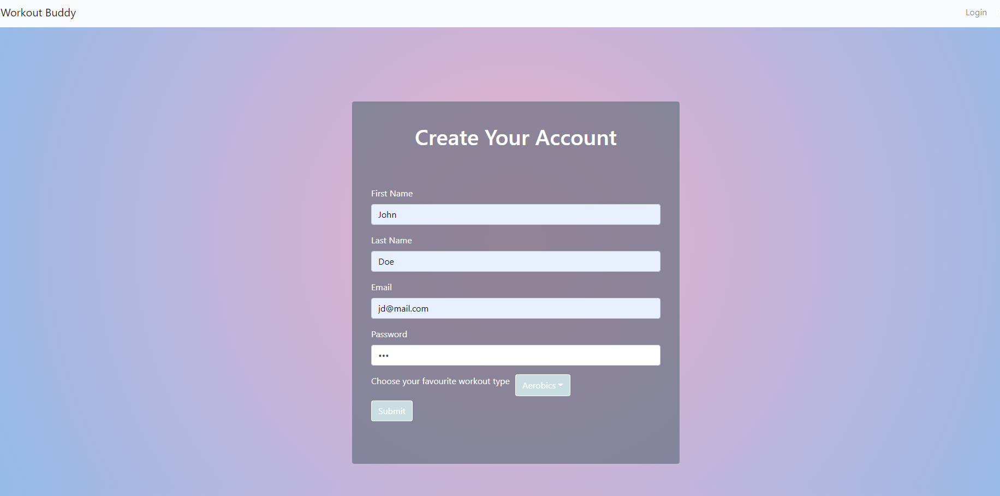
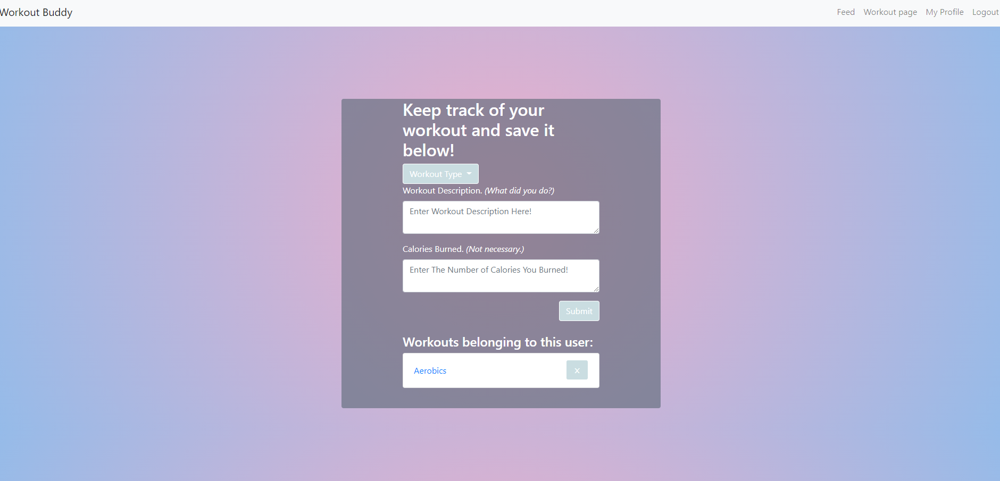
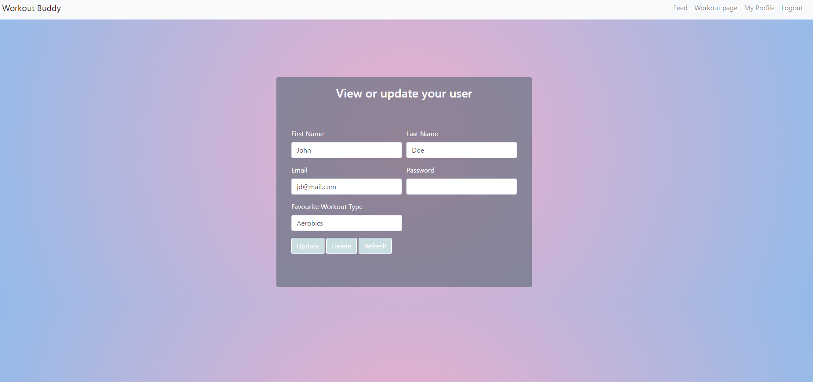
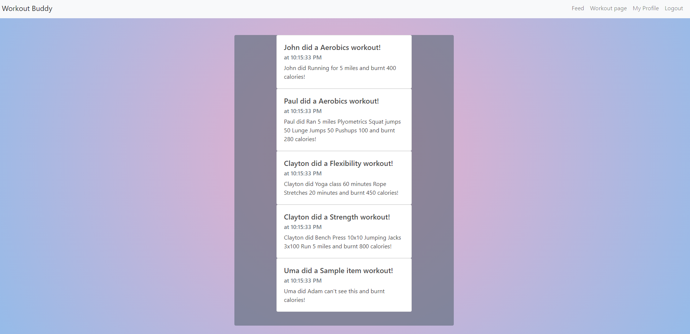

# Project 2. Fitness Tracker

[](https://travis-ci.com/cparros/project-2)


 


## Table of Contents
- [Description](#Description)
- [User Story](#User-Story)
- [Motivation](#Motivation)
- [Installation](#Installation)
- [Our Application uses](#Our-Application-uses)
- [Screenshots](#Screenshots)
- [Contribution](#Contribution)
- [License](#License)
- [Future Developement](#Future-Developement)

***

## Description

This Project is Fitness Tracker that Allows you to save workouts/calories burned and access them later. You also have the ability to see workouts that other users have completed.
The application is available for view at Heroku [click here](https://workout-buddy-unc.herokuapp.com/)

## User Story

As a user desiring to get in shape I want to keep track of my workouts. I am using this application to save and reference workouts I have done in the past.

As competitive bodybuilder I need to keep detailed notes on my workouts and calorie output. This app allows me to look back at every detail I input and make sure I am staying on track. 

## Motivation

The main reason this project was chosen was to provide a way to help people keep track of fitness post COVID-19. With many people unable to stay on top of their fitness after gym closures, we wanted to create an application that would make fitnesss tracking easier as gyms begin to reopen.

## Installation
```
npm init --yes
npm install
```

## Our Application uses:

Handlebars, CSS, Javascript, JQuery, Sequelize, NPM, Gulp, MySQL, Travis and ESLint.

## Screenshots



## Contribution
-Clayton Parros

-Joshua Coleman

-Ishmam Mustain

-Pierce Brelinsky

-Elena Magay


## License
This project uses [MIT](https://opensource.org/licenses/MIT) license Copyright(c) 2021


## Future Developement

1. Mobile functionality;
2. Adding Friends;
3. Looking at other people's profiles;
4. Add Body specific workout grouping (Upper body, Lower Body, etc) and more